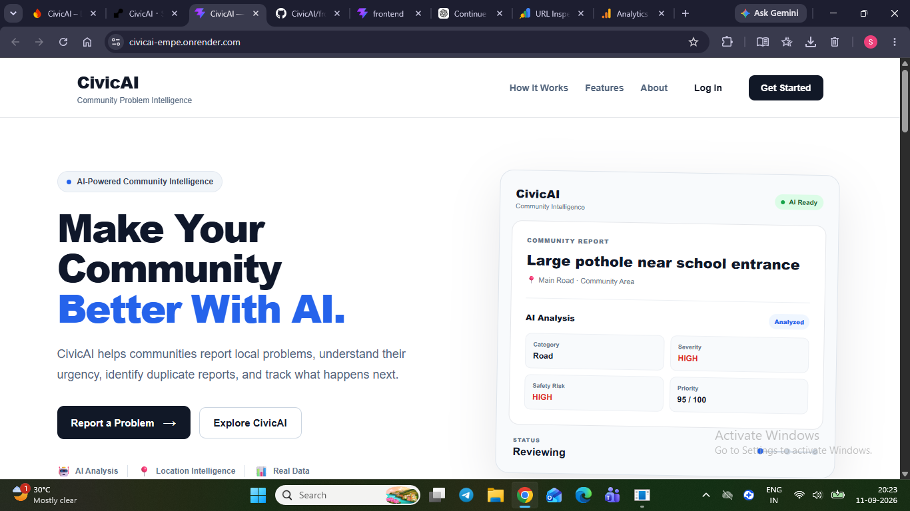
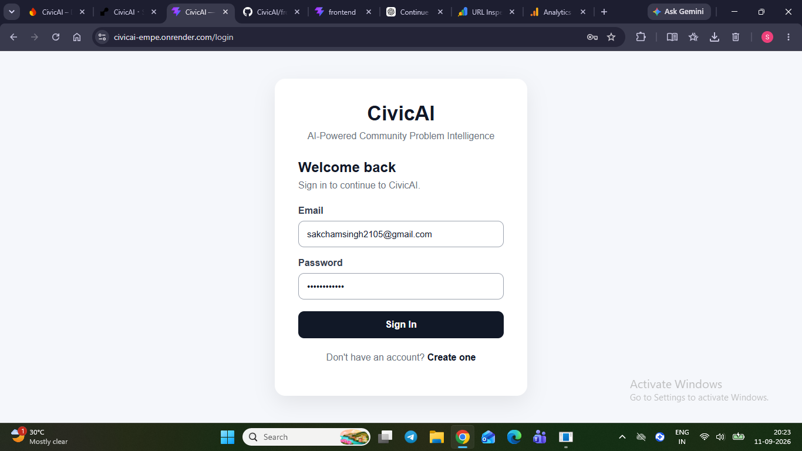
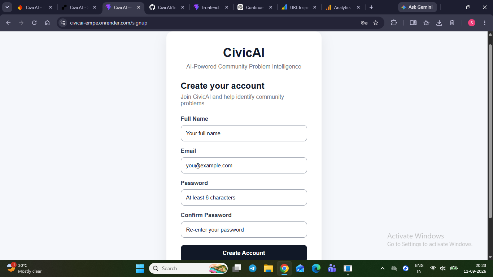
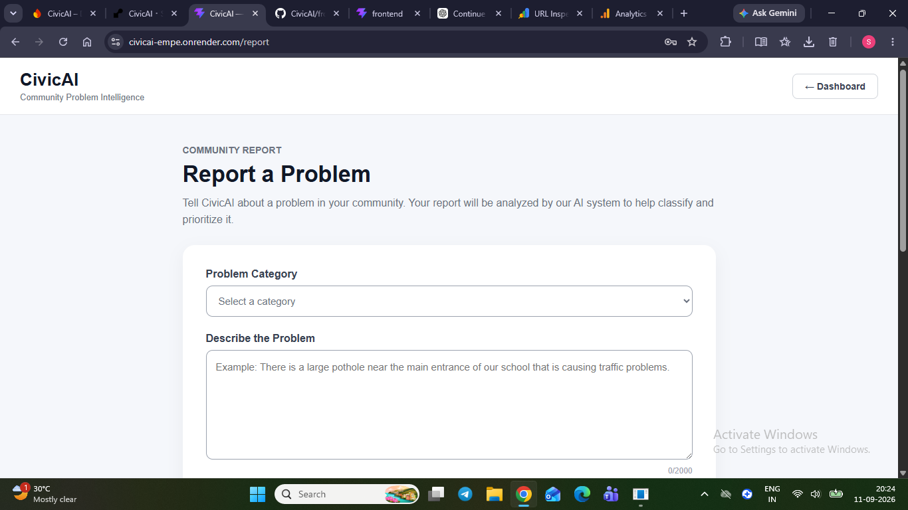
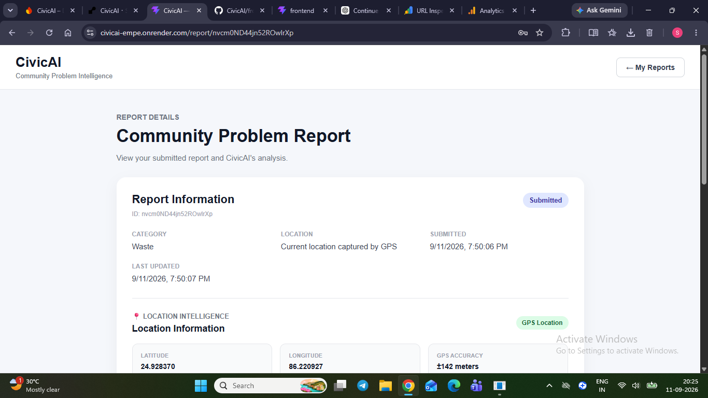
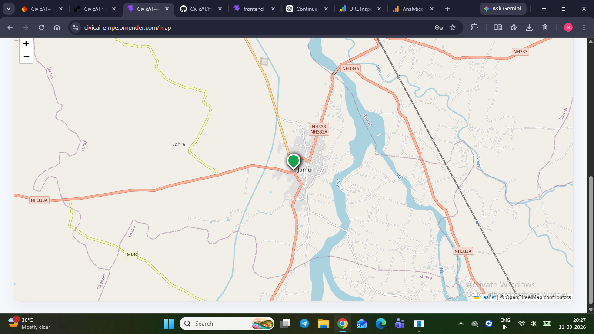
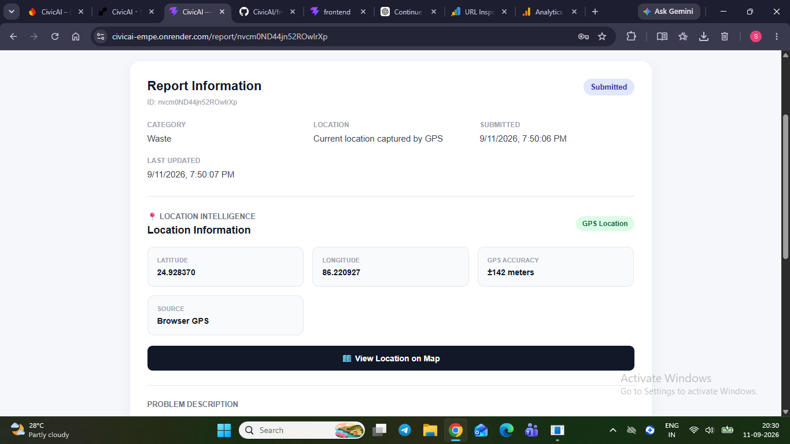
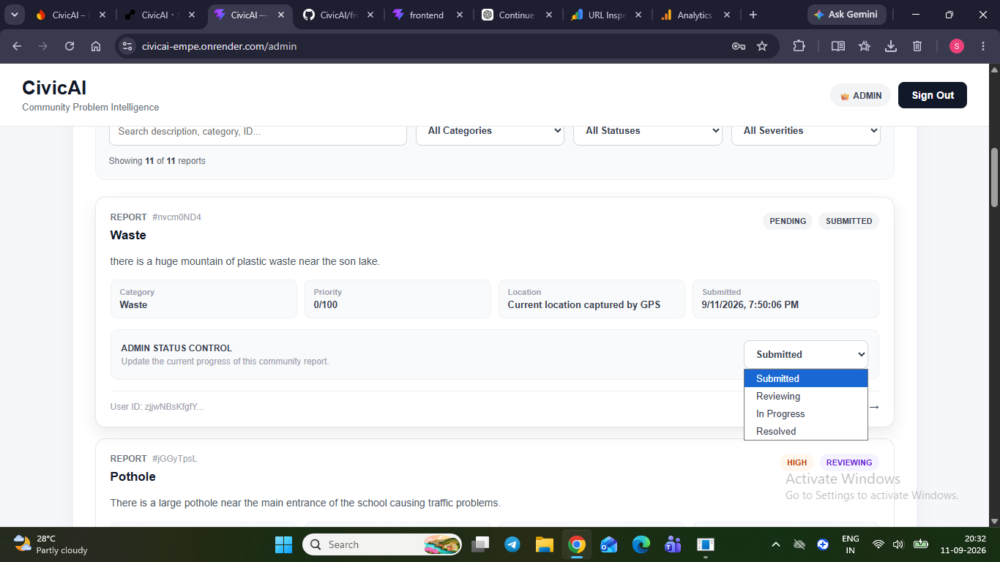
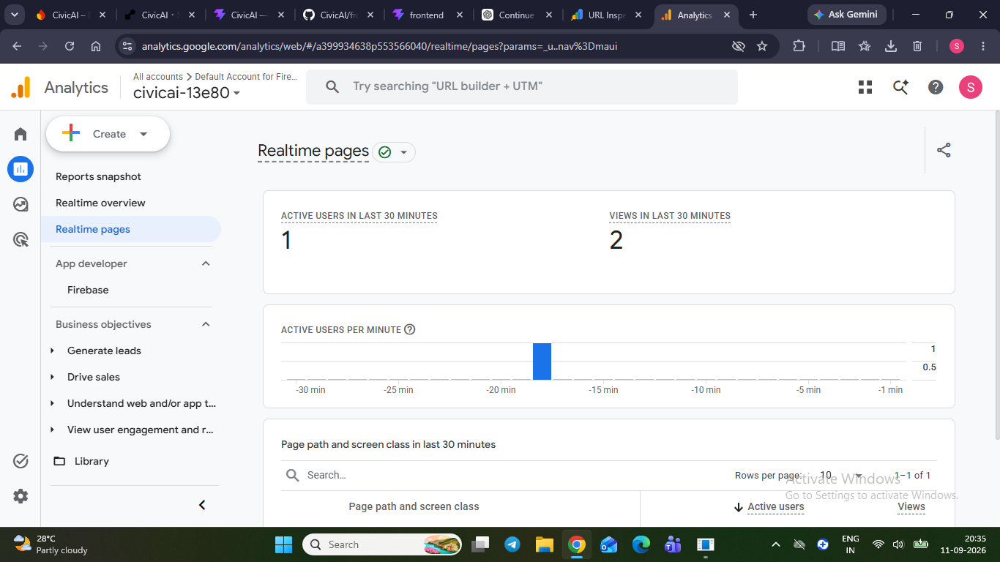

# CivicAI — AI-Powered Community Problem Intelligence

CivicAI is a full-stack AI-powered civic technology platform designed to help communities report, understand, prioritize, map, and track local problems. It combines AI analysis, geolocation, duplicate detection, analytics, and role-based administration to turn individual reports into structured civic intelligence.

## 🌐 Live Project

- **Live Demo:** https://civicai-empe.onrender.com/
- **GitHub:** https://github.com/sakchamkumar/CivicAI
- **Backend API:** https://civicai-backend-qqpr.onrender.com/

---

## 📸 Product Screenshots

### 1. Landing Page



### 2. Login



### 3. Signup



### 4. Report a Community Problem



### 5. AI Analysis and Priority Scoring



### 6. Community Map



### 7. Report Details and Status History



### 8. Admin Dashboard



### 9. Analytics Dashboard



---

## 🎯 Problem Statement

Community problems such as potholes, waste accumulation, water issues, traffic problems, electricity issues, and public-safety concerns are often difficult to organize and prioritize. CivicAI provides a structured reporting workflow and transforms reports into data that can be analyzed, mapped, prioritized, reviewed, and tracked.

---

## ✨ Core Features

### 🤖 AI-Powered Problem Analysis

When a report is submitted, CivicAI sends the relevant problem information to Gemini and generates structured analysis including:

- Problem category
- Subcategory
- Severity
- Safety risk
- AI confidence
- Reasoning
- Priority score

Example response:

```json
{
  "category": "Road",
  "subcategory": "Pothole",
  "severity": "HIGH",
  "safetyRisk": "HIGH",
  "confidence": 0.95,
  "reasoning": "A large pothole can create significant safety risks for vehicles and pedestrians.",
  "priorityScore": 95
}
```

The backend validates the AI response before saving it.

### 🎯 Priority Scoring

Severity and safety risk are converted into a 0–100 priority score so administrators can identify urgent problems more quickly.

### 📍 Geolocation

Users can enter a location manually or allow the browser to obtain GPS coordinates. Reports can store latitude, longitude, location accuracy, and location source.

### 🔎 Duplicate Detection

Before submission, CivicAI checks existing reports for potential duplicates using:

- Text similarity
- Geographic distance
- Geographic score
- Combined duplicate score

This helps reduce repeated reports for the same local issue.

### 🗺️ Community Map

Reports containing coordinates are visualized using **React Leaflet** and **OpenStreetMap**, providing a spatial view of reported community problems.

### 👥 My Reports

Authenticated users can view their submitted reports and open detailed report pages.

### 📄 Report Details

Each report can display its description, category, location, AI analysis, severity, safety risk, priority score, current status, and status history.

### 🔄 Status Workflow

```text
Submitted
   ↓
Reviewing
   ↓
In Progress
   ↓
Resolved
```

Status changes are recorded in a separate status-history timeline for transparency.

### 🛡️ Role-Based Admin Dashboard

Administrators can manage reports using:

- Report statistics
- Search
- Category filters
- Status filters
- Severity filters
- Status updates
- Report management

Normal users are protected from administrative routes through both frontend and backend authorization checks.

### 📊 Community Analytics

The Analytics dashboard calculates information directly from real Firestore report data, including:

- Total reports
- High-priority reports
- Average priority
- Resolved reports
- Category distribution
- Severity distribution
- Status distribution
- Recent reporting trends
- Common problem types
- Highest-priority reports
- Approximate geographic hotspots

**No fabricated analytics data is used.**

---

## 🧠 AI Pipeline

```text
User Report
     ↓
Text + Category + Location
     ↓
CivicAI Backend
     ↓
Gemini AI Analysis
     ↓
Structured Validation
     ↓
Category + Severity + Safety Risk
     ↓
Priority Score
     ↓
Firestore
     ↓
Dashboard / Map / Admin / Analytics
```

---

## 🏗️ System Architecture

```text
                         ┌──────────────────────┐
                         │       User           │
                         │ Report / Track Issue │
                         └──────────┬───────────┘
                                    │
                                    ▼
                         ┌──────────────────────┐
                         │   React + Vite       │
                         │      Frontend        │
                         └──────────┬───────────┘
                                    │ HTTP / REST
                                    ▼
                         ┌──────────────────────┐
                         │ Node + Express       │
                         │      Backend         │
                         └───────┬───────┬──────┘
                                 │       │
                    ┌────────────┘       └─────────────┐
                    ▼                                  ▼
          ┌──────────────────┐                ┌──────────────────┐
          │    Gemini AI    │                │ Firebase Admin   │
          │ Classification   │                │ Auth / Firestore │
          │ Priority / Risk  │                │ Data / Roles     │
          └──────────────────┘                └──────────────────┘
                                 │
                                 ▼
                    ┌────────────────────────┐
                    │ Map / Admin / Analytics│
                    │ Reports / Status Flow  │
                    └────────────────────────┘
```

---

## 🛠️ Technology Stack

### Frontend
- React
- Vite
- React Router
- Axios
- Firebase Web SDK
- React Leaflet
- OpenStreetMap

### Backend
- Node.js
- Express
- Firebase Admin SDK
- Firestore
- Gemini API via `@google/genai`
- Express Rate Limit
- CORS
- dotenv

### Deployment & Observability
- GitHub
- Render
- Google Analytics
- Google Search Console

> **Note:** CivicAI currently uses text + location for AI analysis. Photo upload and image-based AI analysis are not implemented in the current production version.

---

## 🔐 Security and Engineering

CivicAI was built with production-oriented security practices including:

- Firebase Authentication
- Protected user routes
- Role-based admin authorization
- Backend Firebase ID-token verification
- Firestore security rules
- Environment-based secrets
- API rate limiting
- Input validation
- CORS configuration
- No API secrets in frontend source code
- Separate AI-analysis and status-history access controls

---

## 📁 Project Structure

```text
CivicAI/
├── frontend/
│   ├── src/
│   │   ├── components/
│   │   ├── pages/
│   │   ├── firebase.js
│   │   ├── config.js
│   │   ├── App.jsx
│   │   └── main.jsx
│   └── ...
│
├── backend/
│   ├── routes/
│   │   ├── ai.js
│   │   ├── duplicates.js
│   │   └── admin.js
│   ├── utils/
│   │   ├── gemini.js
│   │   └── firebaseAdmin.js
│   ├── server.js
│   ├── package.json
│   └── ...
│
└── README.md
```

---

## 🗃️ Main Data Model

### Users

Stores user identity, profile information, role, and account metadata.

### Reports

Stores:

- User ID
- Description
- Category
- Location
- Latitude / longitude
- Location accuracy/source
- AI analysis status
- AI classification
- Severity
- Safety risk
- Priority score
- Current status
- Timestamps

### AI Analysis

Stores validated AI analysis information associated with reports.

### Status History

Stores previous status, new status, user/report association, administrator who made the change, and timestamp.

---

## 🚀 Local Development

### 1. Clone the repository

```bash
git clone https://github.com/sakchamkumar/CivicAI.git
cd CivicAI
```

### 2. Frontend

```bash
cd frontend
npm install
npm run dev
```

### 3. Backend

In another terminal:

```bash
cd backend
npm install
npm start
```

Configure the required environment variables locally. Never commit `.env` files or Firebase service-account credentials.

---

## 🧪 Testing and Verification

The following production workflows have been tested:

- User signup and login
- Protected routes
- Report creation
- Browser GPS location
- Gemini AI analysis
- Severity and priority scoring
- Duplicate detection
- Community map
- My Reports
- Report Details
- Status-history timeline
- Admin role protection
- Admin status management
- Admin search and filters
- Analytics using real Firestore data
- Production frontend/backend deployment
- Google Analytics real-time tracking
- Google Search Console indexing

---

## 📈 Responsible Engineering

CivicAI intentionally avoids presenting fabricated community statistics or pretending to have machine-learning predictions without sufficient historical data. Current analytics are calculated from real Firestore reports, while more advanced predictive modeling can be added only after enough reliable historical data is collected.

Similarly, AI-generated classifications are validated before being stored rather than being treated as unquestioned ground truth.

---

## 🔮 Future Improvements

Potential future work includes:

- Larger-scale deployment and community testing
- More advanced geographic hotspot analysis
- Historical trend modeling
- Real predictive models once sufficient data exists
- Improved duplicate detection
- Additional administrative workflows
- Notifications for report status changes
- Optional multimodal reporting if appropriate infrastructure becomes available

---

## 🎓 Why I Built This

CivicAI explores how AI can be applied beyond chatbots to a practical civic problem: turning unstructured community reports into information that can be prioritized, mapped, reviewed, and tracked.

The project combines **AI, full-stack engineering, geospatial data, databases, authentication, security, analytics, and deployment** in one system.

---

## 👨‍💻 Author

**Sakcham Kumar**

CivicAI is part of a broader set of projects exploring how computer science and AI can solve practical problems in education, research, and communities.

Related project:
- **EduBridgeAI** — AI-powered education and college-admissions platform
- **ResearchLensAI** — AI-powered research-paper analysis and discovery platform

---

## 📄 License

This project is currently presented as a personal portfolio and educational software project.
